# Agente Perry

**AI multi-agent auditor for public procurement documents.**
From 200-page scanned TDRs to evidence-backed risk dossiers with page citations.
**No accusations. Only verifiable public evidence.**


---

## What it does in 60 seconds

```text
Public PDF -> Classifier -> OCR fallback -> Page-cleaned chunks
            -> Retrieval (pgvector) -> Planner agent
            -> Evidence critic -> Risk scoring
            -> Neo4j graph enrichment -> Evidence dossier
```

Reduces the first-pass review of a 200-page procurement document from hours
to minutes, with every flag anchored to a quoted clause and a page number.

> We do not accuse. We surface signals that deserve review.

---

## Why it matters

Public procurement oversight fails when evidence is buried in hundreds of
pages of scanned PDFs. Manual review does not scale. Agente Perry turns
unreadable procurement documents into reviewable dossiers:

- **Journalists** — faster case discovery with quoted evidence.
- **Citizens** — plain-language explanations of complex contracts.
- **Auditors** — prioritized signals with traceable provenance.
- **Civic-tech teams** — reusable open-source infrastructure.

---

## What works today

- TDR PDF parsing with page-level provenance (PyMuPDF).
- Automatic classifier separates textual / mixed / scanned PDFs.
- OCR fallback for scanned documents (provider-agnostic, MiniMax client included).
- LangGraph-based auditor pipeline (planner -> retriever -> evidence critic -> scoring).
- Doctrine-anchored risk analysis with quoted-evidence validation.
- Legal-safe vocabulary filter on all outputs.
- Evidence-backed dossier generation with page citations.
- Hash-based Change Data Capture detector over procurement datasets (no live scraping required).
- Neo4j graph enrichment when supplier RUC is available.
- FastAPI endpoints for health, dossiers, graph and on-demand audit.
- 400+ tests across scrapers, API and document intelligence packages.

## Current limitations

- The public web UI is not included in this repository.
- CDC is dataset/hash-based, not real-time SEACE streaming.
- Neo4j enrichment requires a populated graph and credentials.
- Demo runs expect PDFs in the local golden-set directory.
- Roadmap items (social publishing, real-time discovery) are planned, not shipped.

---

## Architecture

```mermaid
flowchart LR
    A[Public<br/>procurement data] --> B[CDC detector<br/>hash-based]
    B --> C[PDF downloader]
    C --> D[Classifier +<br/>OCR fallback]
    D --> E[Chunker +<br/>pgvector retrieval]
    E --> F[Planner agent]
    F --> G[Evidence critic]
    G --> H[Risk scoring]
    H --> I[Neo4j<br/>graph enrichment]
    I --> J[Evidence<br/>dossier API]

    style A fill:#0f172a,stroke:#3b82f6,color:#e2e8f0
    style B fill:#0f172a,stroke:#8b5cf6,color:#e2e8f0
    style C fill:#0f172a,stroke:#8b5cf6,color:#e2e8f0
    style D fill:#0f172a,stroke:#8b5cf6,color:#e2e8f0
    style E fill:#0f172a,stroke:#10b981,color:#e2e8f0
    style F fill:#0f172a,stroke:#ef4444,color:#e2e8f0
    style G fill:#0f172a,stroke:#ef4444,color:#e2e8f0
    style H fill:#0f172a,stroke:#ef4444,color:#e2e8f0
    style I fill:#0f172a,stroke:#10b981,color:#e2e8f0
    style J fill:#0f172a,stroke:#f59e0b,color:#e2e8f0
```



### Agent roster

| Agent | Role |
|-------|------|
| **CDC detector** | Hash-based change detection over local procurement JSONL |
| **Downloader** | Pulls public procurement documents and metadata |
| **Classifier** | Decides PDF route (textual / mixed / scanned) |
| **OCR worker** | Runs OCR for scanned pages, provider-agnostic |
| **Chunker** | Page-aligned chunks with source provenance |
| **Planner** | Decides which checks to run on each document |
| **Evidence critic** | Validates that every flag is backed by quoted text |
| **Risk scoring** | Aggregates flags into a calibrated dossier score |
| **Graph enricher** | Adds entity context from the procurement graph |
| **Orchestrator** | LangGraph state machine that coordinates the run |

---

## Quick start

```bash
# 1. Install scrapers + document intelligence + API
cd apps/scrapers
uv venv && uv pip install -e ".[dev]"

cd ../../packages/document_intelligence
pip install -e ".[dev]"

cd ../../apps/api
uv venv --python 3.11
uv pip install -e ".[dev]"
uv pip install -e ../../packages/document_intelligence
uv pip install -e ../scrapers
cp .env.example .env  # set credentials
```

### CLI demo

```bash
# Run the auditor over a single procurement document (LangGraph pipeline)
bash scripts/run_auditor_demo.sh tdr_salud_pliego_001

# Run the auditor over the full local golden set
bash scripts/run_auditor_demo.sh --all
```

### API demo

```bash
cd apps/api
.venv/bin/uvicorn agenteperry_api.main:app --reload --port 8080

# In another terminal:
curl http://localhost:8080/health
curl http://localhost:8080/demo/cases
curl http://localhost:8080/dossiers
curl http://localhost:8080/dossiers/<ocid>
curl -X POST http://localhost:8080/audit/<ocid>
```

Swagger UI: <http://localhost:8080/docs>

---

## Example case: ESSALUD TDR

A prepared demo path covers an ESSALUD procurement process:

- **Entity**: ESSALUD
- **OCID**: `ocds-dgv273-seacev3-988512`
- **Sector**: Health
- **Document**: TDR / procurement document
- **Output**: evidence-backed dossier with page citations

Signals the pipeline can surface on this kind of case:

- Potentially restrictive experience requirements.
- Excessive notarial or physical documentation burdens.
- Low-traceability deliverables.
- Subjective evaluation criteria without an objective rubric.

The dossier always quotes the source clause and cites the page number.

---

## Evidence and safety

Every flag must include:

- `flag_code`
- `severity`
- `score_contribution`
- `evidence_quote`
- `page_number`
- `explanation`
- `detection_method`

The legal-safe filter rejects accusatory vocabulary in any generated text.
Full taxonomy and rules: [`docs/METHODOLOGY.md`](docs/METHODOLOGY.md).

Every dossier ships with the disclaimer:

> This analysis identifies risk signals in public documents. It is not an
> accusation and does not determine responsibility. Requires human review
> and cross-check with the official source.

---

## Tech stack

| Layer | Technology |
|-------|------------|
| API | FastAPI (Python 3.11+) |
| Agent orchestration | LangGraph |
| Document intelligence | Custom agent runtime + AI SDK provider routing |
| PDF parsing | PyMuPDF with classifier and OCR fallback |
| Vector store | Supabase Postgres + pgvector |
| Entity graph | Neo4j |
| Object storage | Cloud object storage (provider-agnostic) |
| Infra | Docker compose for local dev |

---

## Repository layout

```
apps/
  api/                       FastAPI orchestrator and dossier endpoints
  scrapers/                  Ingestion CLI, parser, chunker, flag engine, CDC
packages/
  document_intelligence/     Planner, evidence critic, risk scoring, doctrine
  db/                        Postgres migrations and seed registry
  shared/                    Cross-package types and utilities
infra/
  docker/                    Local dev compose
  supabase/                  Supabase project config
scripts/
  run_auditor_demo.sh        Interactive LangGraph audit demo
  run_golden_set.py          Batch evaluation over the local golden set
  build_doctrine_index.py    Build the legal doctrine index
  phase1_*.py                Pipeline stages for the discovery phase
docs/
  ARCHITECTURE.md            System architecture
  METHODOLOGY.md             Risk signal taxonomy and legal-safe language
```

---

## Roadmap

- Public web dossier UI.
- Real-time procurement discovery (live SEACE / OCDS streaming).
- Expanded doctrine index for additional jurisdictions.
- Higher-throughput batch audit mode.

---

## Methodology

The risk-signal taxonomy and the legal-safe vocabulary are documented in
[`docs/METHODOLOGY.md`](docs/METHODOLOGY.md). The framework references the
public **FUNES** methodology published by Ojo Publico.

---

## Anonymity policy

This is an anti-corruption project. Several teams working on similar
hackathons have chosen not to publicly associate their identities with the
project — names are not shared on social media, repositories, or with
sponsors. **Teams can compete and win every prize anonymously like any
other team.**

For this reason:

- The repository does not list individual contributors.
- Author metadata in package manifests uses a shared project pseudonym.
- All inbound communication goes through a single shared mailbox.

If you are a team, journalist or organization that wants to collaborate or
needs to verify identities for legitimate purposes, write to the contact
address below from your institutional email. We reply within 24–48 hours
after verifying the requester.

---

## Contact

📧 **hackaton942@gmail.com**

Please include:

- The institutional context of your request.
- A verifiable institutional email or domain.
- The specific dataset, dossier or finding you want to discuss.

We do not engage through social media, public issues or direct messages.

---

## License

MIT. See package-level `pyproject.toml` files.
