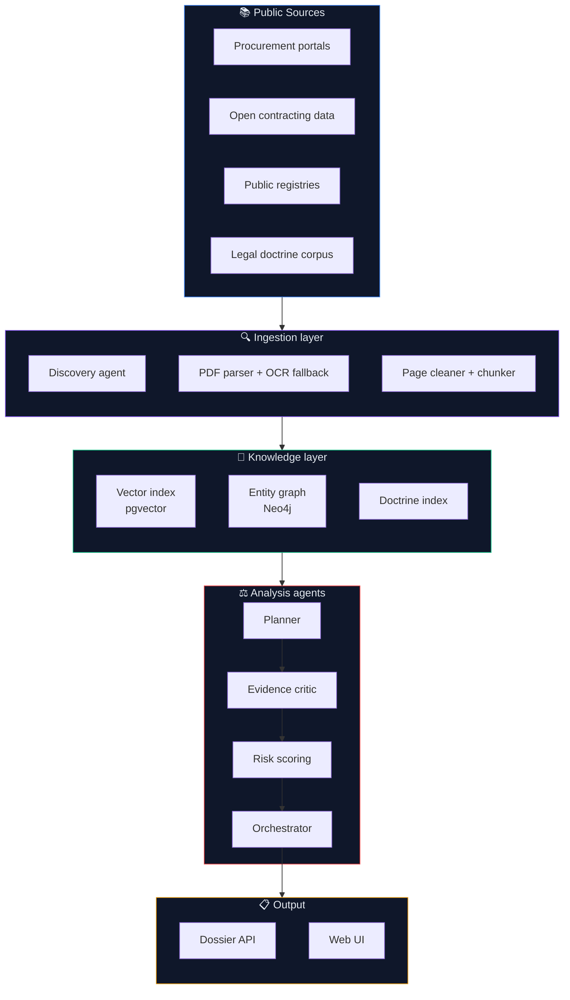

# Agente Perry

**Multi-agent system that surfaces risk signals in Peruvian public procurement
using only publicly available evidence.**

Agente Perry analyzes Terms of Reference (TDR) and procurement documents at
scale, anchoring every signal to a verifiable source fragment. It is built
for journalists, civic-tech teams and academic researchers working on
procurement integrity.

> We do not accuse. We surface signals with traceable public evidence.
> Every output is investigative input, not a verdict.

---

## Why this exists

Public procurement in Peru moves billions of soles per year through tens of
thousands of documents. Most red flags are buried in legalese, scanned PDFs
and disconnected portals. Manual review does not scale.

Agente Perry is a coordinated system of specialized agents that reads,
parses, indexes, cross-references and scores these documents, returning a
**dossier** with quoted evidence and page citations.

---

## Architecture overview



### Agent roster

| Agent | Role |
|-------|------|
| **Discovery** | Locates and downloads public procurement documents |
| **PDF parser** | Extracts text with OCR fallback for scanned documents |
| **Chunker** | Page-aligned chunks with source provenance |
| **Doctrine retriever** | Surfaces relevant legal precedents per clause |
| **Planner** | Decides which checks to run on a given document |
| **Evidence critic** | Validates that each flag is supported by quoted text |
| **Risk scoring** | Aggregates flags into a calibrated dossier score |
| **Graph enricher** | Adds entity-context signals from the procurement graph |
| **Orchestrator** | Coordinates the full audit run end-to-end |

---

## Tech stack

| Layer | Technology |
|-------|------------|
| Web UI | Next.js 15 (App Router) |
| API | FastAPI (Python 3.11+) |
| Document intelligence | Custom agent runtime + AI SDK provider routing |
| Vector store | Supabase Postgres + pgvector |
| Entity graph | Neo4j |
| Object storage | Cloud object storage (provider-agnostic) |
| Infra | Docker compose for local dev |

---

## Repository layout

```
apps/
  api/                       FastAPI orchestrator and dossier endpoints
  scrapers/                  Ingestion CLI, parser, chunker, flag engine
  web/                       Next.js 15 dossier UI
packages/
  document_intelligence/     Planner, evidence critic, risk scoring, doctrine
  db/                        Postgres migrations and seed registry
  shared/                    Cross-package types and utilities
infra/
  docker/                    Local dev compose
  supabase/                  Supabase project config
```

---

## Quick start

```bash
# 1. Backend API
cd apps/api
uv venv --python 3.11
uv pip install -e ".[dev]"
cp .env.example .env  # set credentials
.venv/bin/uvicorn agenteperry_api.main:app --reload --port 8080

# 2. Document intelligence + ingestion (optional, enables /audit)
uv pip install -e ../../packages/document_intelligence
uv pip install -e ../scrapers

# 3. Web UI
cd ../../apps/web
pnpm install
pnpm dev
```

Swagger UI: <http://localhost:8080/docs>

---

## Methodology

The risk-signal taxonomy and the legal-safe vocabulary are documented in
[`docs/METHODOLOGY.md`](docs/METHODOLOGY.md). The framework references the
public **FUNES** methodology published by Ojo Publico.

Every dossier ships with the disclaimer:

> This analysis identifies risk signals in public documents. It is not an
> accusation and does not determine responsibility. Requires human review
> and cross-check with the official source.

---

## Anonymity policy

This is an anti-corruption project. Several teams working on similar
hackathons have chosen not to publicly associate their identities with the
project — names are not shared on social media, repositories, or with
sponsors. **Teams can compete and win every prize anonymously like any
other team.**

For this reason:

- The repository does not list individual contributors.
- Author metadata in package manifests uses a shared project pseudonym.
- All inbound communication goes through a single shared mailbox.

If you are a team, journalist or organization that wants to collaborate or
needs to verify identities for legitimate purposes, write to the contact
address below from your institutional email. We reply within 24–48 hours
after verifying the requester.

---

## Contact

📧 **hackaton942@gmail.com**

Please include:

- The institutional context of your request.
- A verifiable institutional email or domain.
- The specific dataset, dossier or finding you want to discuss.

We do not engage through social media, public issues or direct messages.

---

## License

MIT. See package-level `pyproject.toml` and `package.json` files.

---

## Status

MVP. Active development. Internal benchmarks and golden-set evaluation are
not published. Demos are available under NDA for verified institutions.
