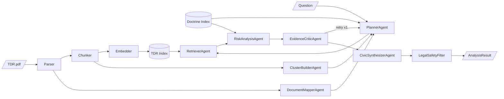

# AGENT_DOCUMENT_CORE

Document Intelligence Core — full spec lives in
`specs/active/SPEC-0007-document-intelligence-core/`.

This page is the operator-facing summary kept in `docs/` so it surfaces in normal
navigation. Architectural diagrams, agent contracts and the full PR plan live with
the spec.

> **For the canonical system architecture** (SEACE → cluster documental →
> auditor → score → GraphRAG → dossier → difusión), see
> [`docs/ARCHITECTURE_AGENTEPERRY.md`](ARCHITECTURE_AGENTEPERRY.md). This file
> only documents Fase 1 (motor documental). Anything outside Fase 1 is
> bloqueado por la regla de activación documentada allí.

## What it is

Local-first agentic pipeline that reads TDR / bases / contract PDFs and emits red flags
with **dual-citation evidence**: a quote from the TDR (page + chunk) plus a quote from
the doctrinal corpus (OCP Red Flags Guide, OECD Governing with AI). Without both, no
flag is emitted.

## Why a separate package

`apps/scrapers/src/agenteperry/tdr/` ships per-page parsing and per-page chunking for
the legacy TDR rule-based pipeline (SPEC-0002…SPEC-0004). Those modules keep powering
the existing rule-based flags.

The new package **does not import them**:

- the new chunker is **cross-page** with sliding-window overlap so 200–500 page PDFs
  produce coherent chunks
- contracts are Pydantic v2 with `extra="forbid"` to enforce agent-to-agent invariants
- the package must run isolated with no Postgres / Supabase / scraper dependencies

The two implementations are intentionally allowed to diverge.

## Pipeline (post-PR4)



## What ships in PR #1 + PR #1b + PR #2 (current)

T0 through T11 of `tasks.md` are closed with real code and tests:

| Module | Status | Notes |
|--------|--------|-------|
| `parsing/pdf_parser.py` | done | PyMuPDF, page provenance, OCR detection, calls header/footer dedup |
| `parsing/text_cleaner.py` | done | whitespace, hyphen joins, multi-newline collapse |
| `parsing/header_footer.py` | done | detects + strips lines repeated on ≥50% of pages (min 3 pages, ≤120 chars) |
| `chunking/chunker.py` | done | cross-page sliding window with paragraph-first boundary |
| `embeddings/base.py` | done | `BaseEmbedder` Protocol |
| `embeddings/fake_embedder.py` | done | deterministic, normalized, API-key-free |
| `embeddings/openai_embedder.py` | done | reads `OPENAI_API_KEY`, fails fast if absent |
| `embeddings/local_embedder.py` | done | sentence-transformers, lazy import |
| `embeddings/__init__.py` | done | factory `get_embedder(mode)` for `mock` / `local-embed` / `llm` |
| `doctrine/loader.py` | done | loads `manifest.json` + `chunks.jsonl` + `vectors.npy`; falls back to stub |
| `doctrine/index.py` | done | `DoctrineIndex.query(text, top_k) -> list[DoctrineHit]` |
| `flags/doctrine_stub.yaml` | done | 9 paraphrased entries (OCP + OECD) for local-first runs |
| `retrieval/index.py` | done | FAISS HNSW + BM25 + RRF fusion + persistence |
| `schemas/` | done | `DocumentPage`, `DocumentChunk`, `DocumentCluster`, `EvidenceItem`, `DoctrineAnchor`, `EvidencePack`, `FlagRecord`, `AnalysisResult` |
| `agents/document_mapper.py` | done (PR #2) | regex heading detection → canonical sections + unmatched pages |
| `agents/cluster_builder.py` | done (PR #2) | writes `chunk.metadata["cluster_label"]` before any TDRIndex consumption |
| `agents/planner.py` | done (PR #2) | doctrine-first plan with `PlannerAudit` and audit log |
| `agents/retriever_agent.py` | done (PR #2) | runs `RetrievalPlan` against `TDRIndex` per FlagQuery |
| `flags/cluster_catalog.yaml` | done (PR #2) | canonical cluster labels and keyword anchors |
| `flags/cluster_flag_map.yaml` | done (PR #2) | flag_code → list of canonical clusters |
| `flags/planner_queries.yaml` | done (PR #2) | flag_code → query templates emitted by PlannerAgent |
| `cli.py` | provisional | smoke entry point only; the canonical CLI is T17 / PR #4 |
| tests | 58 passing | parser, chunker (cross-page + paragraph), header/footer, embedder, factory, doctrine, FAISS index, persistence, document mapper, cluster builder, planner (doctrine-first), retriever |

Risk analysis, evidence critic, civic synthesizer and safety filter land in PRs #3–#4.

## Stable contracts (frozen by PR #1b)

These three contracts are stabilized and will not change in PR #2 except for critical
bug fixes:

- `BaseEmbedder.embed(texts: list[str]) -> np.ndarray` plus
  `get_embedder(mode: "mock"|"local-embed"|"llm", *, model=None, dim=256) -> BaseEmbedder`
- `DoctrineIndex.query(text: str, *, top_k: int = 10) -> list[DoctrineHit]` where
  `DoctrineHit` exposes `chunk_id`, `source`, `section`, `page`, `quote`, `flag_code`, `score`
- `TDRIndex.query(text: str, *, top_k: int = 5, cluster_filter: list[str] | None = None) -> list[RetrievalHit]`
  where `RetrievalHit` exposes `chunk_id`, `page_start`, `page_end`, `text_excerpt`,
  `score` (RRF), `vector_score`, `bm25_score`, `cluster_hint`

The TDR index also exposes `TDRIndex.build(...)`, `TDRIndex.save(base_dir=None)` and
`TDRIndex.load(document_id, *, embedder, base_dir=None)` for orchestration code.

## CLI (canonical)

```bash
python -m document_intelligence analyze tests/fixtures/sample_tdr.pdf \
  --question "Detecta señales de baja trazabilidad y requisitos restrictivos" \
  --pretty
```

Available commands:

| Command | Purpose |
|---------|---------|
| `inspect-pdf <path>` | Parse metadata + per-page summary |
| `chunk-pdf <path>` | Preview chunks |
| `build-index <path>` | Build hybrid index (FAISS + BM25) |
| `doctrine-info` | Load doctrinal corpus metadata |
| `analyze <path>` | **Full pipeline** → JSON legal-safe report |

All commands run without API keys in `mock` mode.

## Tests

```bash
cd packages/document_intelligence
uv run --extra dev pytest tests/ -q
uv run --extra dev ruff check src tests
uv run --extra dev pyright
```

Current: **208 passed**.

## Roadmap

- ~~PR #1 / #1b: data layer + chunking + doctrine stub + retrieval hybrid~~ ✅ done
- ~~PR #2: DocumentMapperAgent, ClusterBuilderAgent, PlannerAgent, RetrieverAgent~~ ✅ done
- ~~PR #3: RiskAnalysisAgent, EvidenceCriticAgent, CivicSynthesizerAgent, LegalSafetyFilter~~ ✅ done
- ~~PR #4: Orchestrator + canonical CLI (`analyze`) + end-to-end tests~~ ✅ done
- ~~PR #5: Golden set infrastructure + first real run~~ ✅ done
- ~~PR #6: Parsing/OCR hardening~~ ✅ done
- ~~PR #7: Pattern hardening (0 FP baseline)~~ ✅ done
- ~~PR #8: Query expansion + debug retrieval + anti-hallucination quote fix~~ ✅ done
- ~~PR #9: Pattern relaxation evidence-backed (first real flags)~~ ✅ done
- ~~PR #10: Severity tuning + reject-reasons coverage~~ ✅ done
- PR #11: Golden set expansion (>=1 PDF no-SIE template) + human verification
- PR #12: Process document pack schema + multi-document orchestration
- PR #13: Score formal de activacion
- PR #14: GraphRAG enrichment (solo si pasa umbral)

## What ships in PR #4 (this commit)

| Module | Status | Notes |
|--------|--------|-------|
| `agents/orchestrator.py` | done | `AgentOrchestrator.analyze_pdf` end-to-end; retry max 1; cache; `OrchestratorState` logs |
| `cli.py` | done | `analyze` command with `--mode`, `--output`, `--pretty`, `--max-retries` |
| `agents/retriever_agent.py` | fix | `doctrine_anchor_id` now propagated from `FlagQuery` → `RetrievalResult` |
| tests | 124 total (+31 new) | `test_orchestrator_e2e.py` (10) covering happy path, flags, legal-safe, retry, JSON, errors |

## OCR / scanned PDFs (PR #6)

Scanned PDFs (every page is an image, no embedded text) are detected and can be
fed through optional OCR before the rest of the pipeline runs.

### When a PDF needs OCR

`parse_pdf` marks a page as `needs_ocr=True` when its cleaned text is shorter
than `low_text_threshold` characters (default 50). If
`pages_needing_ocr == pages_total`, the PDF is fully scanned.

### How to run with OCR

```bash
# Inspect only (no agent pipeline)
python -m document_intelligence inspect-pdf path/to/scanned.pdf --ocr auto

# Full analysis with OCR fallback for low-text pages
python -m document_intelligence analyze path/to/scanned.pdf \
  --question "Detecta senales de baja trazabilidad" \
  --ocr auto

# Force OCR on every page (slow; overrides extracted text)
python -m document_intelligence analyze path/to/x.pdf --question "..." --ocr force
```

Modes:

- `off` (default): no OCR. Pages without text remain empty; `needs_ocr` is reported.
- `auto`: OCR is applied **only** to pages flagged `needs_ocr=True`.
- `force`: OCR is applied to every page (use sparingly).

### Dependencies (optional)

OCR uses Tesseract via `pytesseract`:

```bash
sudo apt-get install tesseract-ocr tesseract-ocr-spa     # Debian/Ubuntu
brew install tesseract tesseract-lang                    # macOS
pip install pytesseract pillow
```

When either dependency is missing, the system runs cleanly with `--ocr off`.
Running `--ocr auto` without Tesseract produces a structured `ocr_error` per
page and a top-level `ocr_available=false` — never a stacktrace. The canonical
`analyze` CLI also surfaces a `parse_summary` object in `analysis.json`, so the
golden-set batch can aggregate OCR stats without changing the public
`AnalysisResult` schema.

### Limitations

- ~1–3s per page at dpi=200. A 200-page PDF can take 5–10 minutes.
- Default language is Spanish (`lang="spa"`). For mixed PDFs, customise
  `TesseractOCRAdapter(lang="spa+eng")`.
- OCR quality depends on scan resolution. Low-quality scans produce noisy
  text and downstream patterns may miss matches.
- For the hackathon: prioritise PDFs with embedded text. Treat OCR as a
  best-effort fallback, not the default path.

## What ships in PR #6 (this commit)

| Module | Status | Notes |
|--------|--------|-------|
| `parsing/ocr.py` | done | `OCRMode`, `OCRResult`, `BaseOCRAdapter`, `NoopOCRAdapter`, optional `TesseractOCRAdapter` |
| `parsing/pdf_parser.py` | hardened | low-text detection, page-level OCR fields, `ParseSummary`, `parse_pdf_with_summary()` |
| `cli.py` | extended | `inspect-pdf --ocr`, `analyze --ocr`, `analysis.json` includes `parse_summary` |
| `agents/orchestrator.py` | extended | accepts `ocr_mode`, optional OCR adapter injection, exposes `last_state` for reporting |
| `scripts/run_golden_set.py` | extended | `--ocr off|auto|force`, aggregated OCR stats in `summary.json` |
| tests | 137 total | OCR adapter, parser integration, CLI OCR, `parse_summary`, and golden-set OCR coverage |

## Legal-safe principle

The system never asserts corruption. It surfaces signals backed by textual evidence
that **require human review**. Banned vocabulary (`corrupto`, `robo`, `fraude`, etc.)
is rejected by `LegalSafetyFilter`; the prohibited list is enumerated
in the spec.

## Invariantes verificadas

- **Dual-evidence**: cada flag aceptada tiene `tdr_evidence.quote` + `doctrine_anchor.quote`.
- **Anti-hallucination**: `EvidenceCriticAgent` verifica literalmente que `quote in chunk_text`.
- **Retry loop**: si `needs_replan=True`, se re-ejecuta PLAN→RET→RISK→CRIT una vez (dobla `top_k`).
- **No API keys**: `mock` mode corre determinísticamente sin red.
- **Cache local**: índices TDR persisten en `~/.cache/document_intelligence/tdr_index/<document_id>/`.
- **Schemas inmutables**: Pydantic v2 `extra="forbid"` previene regresiones de contrato.
