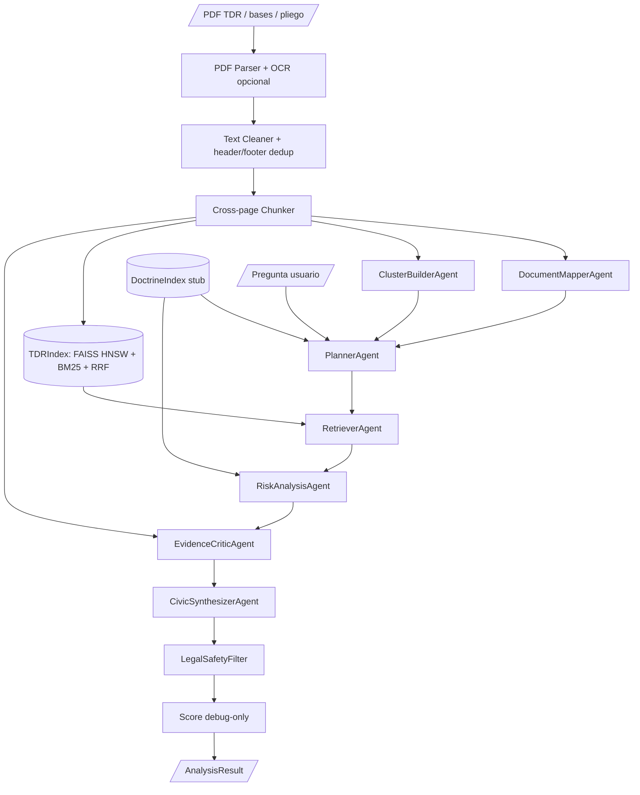

# Auditor Agent Evaluation — AgentePerry

Fecha: 2026-05-17

Scope: **solo Agente Auditor documental**. Este documento no cubre GraphRAG,
Neo4j, fuentes externas ni agente de difusión.

## 1. Veredicto ejecutivo

El Agente Auditor ya existe y está en nivel **V1 funcional / evidence-backed**.

Hoy puede:

- leer PDFs reales de TDR / bases / pliegos;
- extraer texto por página;
- hacer chunking cross-page;
- mapear secciones y clusters documentales;
- planificar búsquedas desde doctrina + intent expansion;
- recuperar chunks con índice híbrido FAISS HNSW + BM25 + RRF;
- detectar flags con reglas calibradas;
- validar evidencia literal contra el chunk original;
- emitir resumen legal-safe, preguntas para autoridad y score debug-only;
- correr sin API keys en modo local determinístico.

Nivel actual de detección: **L3 de 5**.

| Nivel | Estado | Significado |
|---|---|---|
| L1 Parser | Completo | PDF → páginas limpias con OCR opcional |
| L2 Retrieval | Completo V1 | Planner + retrieval híbrido encuentra evidencia relevante |
| L3 Flags evidence-backed | Completo V1 | Emite señales con quote, página y doctrina stub |
| L4 Evaluación robusta | Parcial | Falta golden set más grande con labels humanos por página |
| L5 Producción | No todavía | Falta DoctrineIndex real, calibración por sector y API estable |

Conclusión: **sí tenemos agente auditor**, pero todavía no es un detector
productivo general. Es un motor de auditoría documental V1 con 5 señales reales

## 2. Tesis del Agente Auditor

AgentePerry Auditor **no acusa corrupción**. Audita documentos de contratación
pública y detecta señales de riesgo verificables contra doctrina pública. Cada
señal debe tener:

- `flag_code`;
- severidad;
- quote literal del TDR;
- página;
- chunk id;
- cluster documental;
- ancla doctrinal;
- explicación legal-safe;
- score debug-only.

Si falta evidencia textual, el agente no debe emitir flag.

## 3. Arquitectura actual del agente



## 4. Cómo usa APIs y modelos hoy

### Modo default: sin API externa

El modo default es `mock`:

```bash
python -m document_intelligence analyze path/to.pdf \
  --question "Detecta senales de baja trazabilidad y requisitos restrictivos"
```

Usa `FakeEmbedder`, un embedder determinístico por hash. No usa red, no usa API
keys y es reproducible en tests.

### Modo local-embed

Disponible pero no default:

```bash
python -m document_intelligence analyze path/to.pdf \
  --mode local-embed \
  --question "Detecta senales de riesgo"
```

Usa `sentence-transformers`. El modelo default actual es:

```text
sentence-transformers/all-MiniLM-L6-v2
```

Recomendación para español y contratación pública:

```text
intfloat/multilingual-e5-base
BAAI/bge-m3
sentence-transformers/paraphrase-multilingual-MiniLM-L12-v2
```

El adapter ya acepta `model=...`, pero el CLI todavía no expone `--model`.

### Modo llm

Disponible solo para embeddings OpenAI:

```bash
export OPENAI_API_KEY
python -m document_intelligence analyze path/to.pdf \
  --mode llm \
  --question "Detecta senales de riesgo"
```

Modelo default:

```text
text-embedding-3-small
```

Importante: hoy **no hay LLM generando acusaciones ni decisiones**. El LLM, si
se activa, solo sirve para embeddings. La detección sigue siendo rule-based y
evidence-backed.

## 5. APIs actuales del agente

### CLI pública

Comandos relevantes:

```bash
python -m document_intelligence inspect-pdf <pdf>
python -m document_intelligence chunk-pdf <pdf>
python -m document_intelligence build-index <pdf>
python -m document_intelligence doctrine-info
python -m document_intelligence analyze <pdf> --question "..."
```

Debug de auditoría:

```bash
python -m document_intelligence analyze <pdf> \
  --question "Detecta senales de baja trazabilidad y requisitos restrictivos" \
  --debug-retrieval \
  --pretty
```

### Python API interna

```python
from document_intelligence.agents.orchestrator import AgentOrchestrator

orchestrator = AgentOrchestrator()
result = orchestrator.analyze_pdf(
    "data/golden_set/pdfs/tdr_salud_pliego_001.pdf",
    "Detecta senales de baja trazabilidad y requisitos restrictivos",
)
```

Output principal:

```python
AnalysisResult(
    document=str,
    question=str,
    clusters_inspected=list[str],
    flags=list[FlagRecord],
    summary=str,
    questions_for_authority=list[str],
    missing_data=list[str],
    confidence="low|medium|high",
    score=int,
    score_breakdown=ScoreBreakdown,
    graph_rag=GraphRAGActivation,  # debug-only, no activa GraphRAG
)
```

## 6. Runs ejecutados

Comando de verificación del paquete:

```bash
cd packages/document_intelligence
uv run --extra dev pytest tests/ -q
uv run --extra dev ruff check src tests
uv run --extra dev pyright
```

Resultado:

```text
208 passed, 3 warnings
ruff: All checks passed
pyright: 0 errors
```

Golden set:

```bash
python3 scripts/run_golden_set.py \
  --metadata data/golden_set/metadata.csv \
  --pdf-dir data/golden_set/pdfs \
  --out /tmp/opencode/agenteperry-auditor-runs \
  --python packages/document_intelligence/.venv/bin/python \
  --ocr off
```

Resultado:

```text
documents_total: 4
documents_analyzed: 4
flags_total: 5
errors: []
flags_by_code:
  EXCESSIVE_DOCUMENT_REQUIREMENT: 2
  OVER_SPECIFIED_EXPERIENCE: 3
documents_with_no_flags: 1
```

Outputs guardados para inspección local:

```text
/tmp/opencode/agenteperry-auditor-runs/summary.json
/tmp/opencode/agenteperry-auditor-runs/tdr_salud_pliego_001.debug.json
/tmp/opencode/agenteperry-auditor-runs/tdr_ambiente_positive_001.debug.json
/tmp/opencode/agenteperry-auditor-runs/tdr_ambiente_pliego_001.debug.json
```

## 7. Casos de ejemplo

### Caso A — Salud / flag fuerte

Documento:

```text
tdr_salud_pliego_001.pdf
```

Flag:

```text
OVER_SPECIFIED_EXPERIENCE
severity: high
page: 206
confidence: 0.65
score: 60
GraphRAG activation: false
blocker: no_primary_key
```

Quote:

```text
contratación de servicios iguales o similares al objeto de convocatoria de los últimos ocho (08) años
```

Interpretación legal-safe:

```text
Señal de experiencia previa restrictiva. Requiere revisión humana porque combina
objeto similar + ventana temporal de ocho años.
```

Este es el mejor caso actual del agente.

### Caso B — Ambiente / carga documental notarial

Documento:

```text
tdr_ambiente_positive_001.pdf
```

Flag:

```text
EXCESSIVE_DOCUMENT_REQUIREMENT
severity: medium
page: 21
confidence: 0.55
```

Quote:

```text
Contrato de consorcio con firmas legalizadas ante notario público de cada uno de los integrantes
```

Interpretación:

```text
Señal de carga documental notarial. No prueba irregularidad; sí merece revisión
por posible barrera de participación.
```

### Caso C — Ambiente / señal débil correctamente degradada

Documento:

```text
tdr_ambiente_positive_001.pdf
```

Flag:

```text
OVER_SPECIFIED_EXPERIENCE
severity: low
page: 52
confidence: 0.45
cluster: Otros
```

Quote:

```text
experiencia especifica establecida en las bases del procedimiento
```

Interpretación:

```text
El agente la mantiene como pista para revisión humana, pero la degrada a low
porque parece texto de plantilla y no contiene número de años, monto ni requisito concreto.
```

Esto es correcto. Evita inflar el score con boilerplate.

### Caso D — Negativo controlado

Documento:

```text
tdr_ambiente_pliego_001.pdf
```

Resultado:

```text
flags: []
score: 0
GraphRAG activation: false
blocker: no_accepted_flags
```

Interpretación:

```text
El agente no fuerza flags cuando no encuentra evidencia suficiente.
```

## 8. Nivel real de detección

El agente detecta bien **dos familias de señales**:

1. `OVER_SPECIFIED_EXPERIENCE`
   - experiencia mínima;
   - servicios iguales o similares al objeto;
   - experiencia específica establecida en bases;
   - monto acumulado mínimo.

2. `EXCESSIVE_DOCUMENT_REQUIREMENT`
   - firmas legalizadas ante notario;
   - copia legalizada;
   - fedateado / foliado / visado;
   - original y copia;
   - tres juegos;
   - sobre cerrado.

El agente tiene patrones para más flags, pero todavía no están validados en PDFs
reales suficientes:

- `LOW_TRACEABILITY_OUTPUT`
- `OBSOLETE_PHYSICAL_FORMAT`
- `SPECIFIC_EQUIPMENT_REQUIREMENT`
- `EXCESSIVE_CERTIFICATION_REQUIREMENT`
- `SUBJECTIVE_EVALUATION_CRITERIA`
- `UNREALISTIC_DEADLINE`

## 9. Riesgos actuales

### Riesgo 1 — Golden set pequeño

Solo hay 4 documentos en el run actual. Dos son variantes del mismo template ANA.
No alcanza para decir que el detector generaliza por sector.

### Riesgo 2 — Labels incompletos

`summary.json` muestra flags como `unexpected` porque `metadata.csv` no tiene
todos los expected flags humanos llenados. Eso no significa automáticamente
false positive; significa que falta etiquetado humano.

### Riesgo 3 — Doctrina stub

La doctrina existe como stub. Para un agente serio se necesita corpus real
OSCE/OECE/OCP/OECD indexado, con páginas y citas exactas.

### Riesgo 4 — No hay evaluación por precisión/recall real

La métrica actual es aproximada. Hace falta una tabla humana por documento:

```text
document_id,page,flag_code,label,expected_quote,severity_expected,reviewer_notes
```

### Riesgo 5 — Quote windows cortos

Algunas citas salen truncadas desde `text_excerpt`. Son literales y verificadas,
pero para reporte humano conviene expandir ventana de quote o incluir contexto
antes/después.

## 10. Qué modelo conviene usar

### Recomendación inmediata

Mantener el agente como **deterministic evidence-first**:

```text
Planner deterministic + retrieval híbrido + regex calibrado + critic literal + safety filter
```

No meter LLM generativo para decidir flags todavía.

### Mejor upgrade de modelo

Primero mejorar embeddings, no generación:

1. Local recomendado:

```text
BAAI/bge-m3
```

Ventaja: multilingüe, fuerte para retrieval, corre local si hay recursos.

2. API recomendado:

```text
OpenAI text-embedding-3-small
```

Ventaja: estable, barato, ya soportado por el adapter.

3. Para hackathon/demo sin API:

```text
mock + BM25 + patterns calibrados
```

Ventaja: reproducible y no falla por credenciales.

## 11. Cómo desarrollarlo mejor desde aquí

### Fase A — Evaluation first

Prioridad máxima: mejorar etiquetas, no meter más features.

Tareas:

1. Completar `metadata.csv` con expected flags reales.
2. Crear `data/golden_set/human_labels.csv` con página y quote esperado.
3. Separar labels:
   - `true_positive`
   - `weak_signal`
   - `false_positive`
   - `missed_signal`
4. Correr golden set en cada PR.
5. Reportar precisión/recall real por flag_code.

### Fase B — Mejorar evidencia

Tareas:

1. Expandir quote window para que la cita sea legible.
2. Guardar `context_before` y `context_after`.
3. Añadir `evidence_strength`: `weak|medium|strong`.
4. Añadir `review_status`: `auto_detected|human_verified|rejected`.

### Fase C — DoctrineIndex real

Tareas:

1. Ingestar doctrina OSCE/OECE/OCP/OECD.
2. Chunkear doctrina con fuente, página, sección.
3. Reemplazar stub por artifact real.
4. Agregar tests de doctrina: quote exacta + source exacta.

### Fase D — Model upgrade

Tareas:

1. Exponer `--embedder-model` en CLI.
2. Probar `BAAI/bge-m3` local vs `text-embedding-3-small`.
3. Comparar retrieval hit@k en golden set.
4. Elegir modelo por métrica, no por intuición.

### Fase E — Agent API estable

Tareas:

1. Crear endpoint local o función estable:

```text
POST /audit-document
input: pdf_path | file bytes + question + mode
output: AnalysisResult
```

2. Congelar schema de `AnalysisResult`.
3. Versionar flags y scoring formula.

## 12. Próximo PR recomendado

Nombre sugerido:

```text
PR #11 — Auditor Evaluation Harness
```

Objetivo:

```text
Convertir el agente de demo funcional a sistema evaluable.
```

Scope:

- no GraphRAG;
- no Neo4j;
- no SUNAT/JNE/Contraloría;
- no TikTok;
- solo Agente Auditor.

Entregables:

1. `data/golden_set/human_labels.csv`
2. `scripts/evaluate_auditor_agent.py`
3. métricas por flag:
   - TP
   - FP
   - FN
   - weak signals
   - precision
   - recall
4. reporte JSON:

```text
data/golden_set/outputs/auditor_eval_summary.json
```

5. tests de evaluación.

Definition of done:

```text
pytest green
ruff green
pyright green
golden set eval produce métricas reales
ninguna flag sin quote literal + página + doctrina
```

## 13. Mensaje para el equipo

El agente auditor ya existe. No hay que empezar de cero.

La mejor forma de desarrollarlo ahora no es meter GraphRAG ni LLM generativo.
La mejor forma es convertirlo en un detector medible:

```text
PDF real → flag real → quote literal → página → doctrina → critic → score → evaluación humana
```

Cuando esa cadena sea estable en 10–20 PDFs, recién conviene abrir multi-doc,
fuentes externas o GraphRAG.
