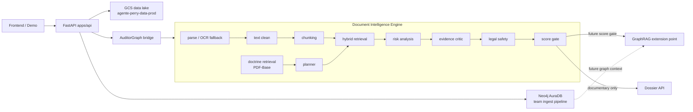

# Backend Unified Architecture — AgentePerry

This document explains the backend shape that this branch consolidates for the
official `agente-perry/agente-p` repo.

The goal is not to pretend that every future capability is already built. The
goal is to present the existing work as one coherent backend architecture with
clear extension points for doctrine retrieval, process packs, scoring, and
future GraphRAG.

## Thesis

AgentePerry does not accuse corruption. It audits public procurement documents,
detects evidence-backed risk signals, cites the exact source text, and only
escalates to network investigation when the documentary score justifies it.

## Current backend layers

```text
agente-p/
├── apps/api/                         FastAPI service for demo/API integration
├── apps/scrapers/                    TDR ingestion, parsing, flags and AuditorGraph bridge
├── packages/document_intelligence/   Document Intelligence engine
├── packages/db/                      Postgres/pgvector schema foundation
├── ingest/                           Existing GCS -> Neo4j pipeline from team repo
├── ontology/                         Existing graph ontology / flag Cypher assets
├── data/PDF-Base/                    Public doctrine PDFs only
├── docs/                             Architecture and operating docs
└── specs/                            Spec-driven roadmap and active work
```

## Runtime architecture



## API surface

Implemented foundation:

| Endpoint | Purpose |
|----------|---------|
| `GET /health` | Service health and readiness flags |
| `GET /demo/cases` | Demo case catalogue backed by real dossier counters when available |
| `GET /dossiers` | List dossier folders available in GCS |
| `GET /dossiers/{ocid}` | Read `dossier.json` from GCS |
| `GET /dossiers/{ocid}/flags` | Read `flags.json` from GCS |
| `GET /dossiers/{ocid}/markdown` | Read `dossier.md` from GCS |
| `GET /graph/counts` | Read graph summary from Neo4j when configured |
| `GET /graph/company/{ruc}` | Read company graph profile from Neo4j when configured |
| `GET /graph/flags` | Read graph flag aggregation from Neo4j when configured |
| `POST /audit/{ocid}` | Optional on-demand AuditorGraph run when local engine deps are installed |

## Doctrine corpus policy

`data/PDF-Base/` is intentionally committed because it contains public doctrine
PDFs used as criteria for audit. This is different from operational data.

Allowed in git:

- public doctrine source PDFs;
- `data/PDF-Base/README.md`;
- `data/PDF-Base/manifest.yaml`.

Not allowed in git:

- SEACE TDR PDFs;
- scraped JSONL/CSV outputs;
- dossier outputs;
- embeddings/vectors/indexes;
- OCR generated text;
- credentials.

## Future GraphRAG posture

This branch makes the backend GraphRAG-ready but does not activate GraphRAG by
default.

GraphRAG must remain behind a score gate:

1. At least one accepted documentary flag exists.
2. The flag has exact quote, page, source and doctrine anchor.
3. Process score crosses the configured threshold.
4. A usable primary key exists: `ocid`, `entity_ruc`, or `supplier_ruc`.
5. The external facts exist in source systems; no invented relationships.

Qdrant or another vector store can be added behind the doctrine/process
retrieval interface later. The current repo keeps source PDFs and code; derived
vector artifacts stay out of git.

## Development rule

Do not build downstream virality or investigative claims before evidence exists.

The sequence is:

```text
document evidence -> score -> optional GraphRAG -> dossier -> citizen content
```

Skipping steps creates legal and technical risk.
