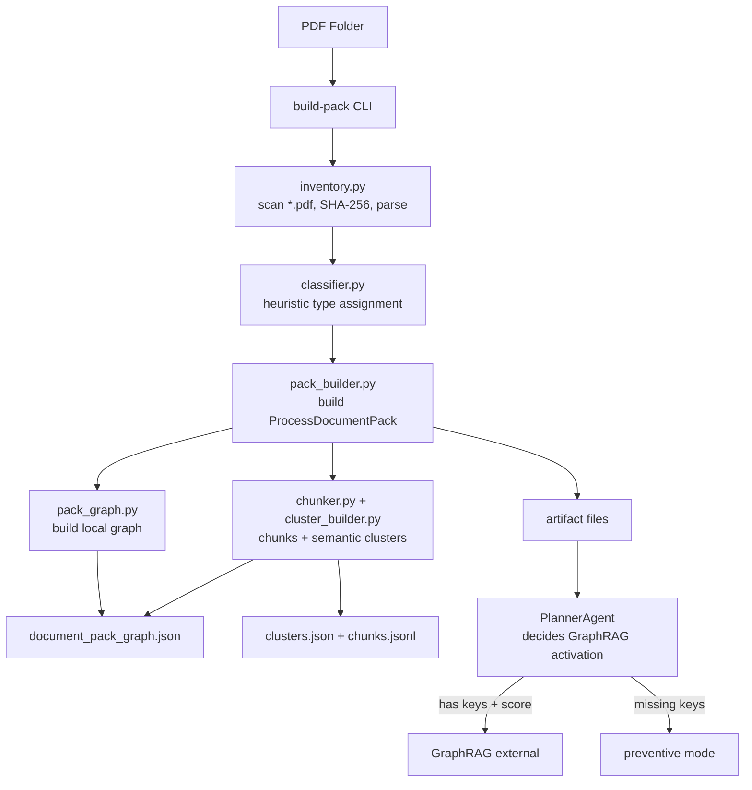

# Document Pack Graph — SPEC-0009

## Qué problema resuelve

Cuando arrives a un folder de PDFs (`data/PDF-Base` o cualquier carpeta de documentos
de un proceso de contratación), no hay forma de saber:

- Cuántos PDFs hay y cuáles son sus propiedades básicas (páginas, texto, OCR).
- Qué tipo de documento es cada PDF (TDR, bases integradas, buena pro, contrato...).
- Si el pack está completo para hacer un análisis preventivo o si ya tiene ganador
  para un análisis investigativo.
- Qué keys faltan para activar GraphRAG (RUC, OCID, entidad, proveedor).
- Cuántos chunks y clusters útiles se pueden generar.

`build-pack` responde todo eso sin tocar fuentes externas, sin LLM obligatorio
y sin abrir GraphRAG todavía.

---

## Por qué no es GraphRAG todavía

GraphRAG completo requiere:

1. **Señal documental aceptada** — un clasificador que determine que el corpus
   tiene suficiente señal (TDR/bases + award document).
2. **Evidencia textual** — chunks con embeddings que soporten búsqueda vectorial.
3. **Score sobre umbral** — el PlannerAgent necesita haber detectado flags
   candidatos con evidencia suficiente.
4. **Llave usable** — RUC del proveedor, OCID del proceso, nombre de entidad
   o identificador del ganador.

`document_pack` genera la **estructura** que el futuro PlannerAgent va a usar
para tomar esa decisión. No la toma todavía.

---

## Cómo se relaciona con GraphRAG futuro

```
PDF folder
  └─ build-pack
       ├─ pdf_inventory.json         ← qué PDFs hay, SHA-256, páginas
       ├─ document_manifest.json     ← tipo de cada PDF (heurístico)
       ├─ process_document_pack.json ← modo: preventive / investigative
       ├─ document_pack_graph.json   ← nodos y edges locales
       ├─ clusters.json              ← clusters temáticos
       ├─ chunks.jsonl               ← chunks con page_start/page_end
       ├─ parse_report.json          ← diagnóstico de parseo
       └─ pack_summary.md            ← resumen legible

                    ↓ futuro

PlannerAgent consulta el pack y decide:
  ¿hay TDR/bases? ¿hay award document?
  ¿score de flags > umbral?
  ¿hay RUC/OCID/entidad/proveedor?
        │
        ├─ NO  → sigue en modo preventivo, sin GraphRAG
        └─ YES → activa GraphRAG externo (Neo4j / Graphiti)
```

---

## Estructura de artefactos

```
data/PDF-Base/
  795de142-en.pdf
  OCP2024-RedFlagProcurement-1.pdf
  _index/
    pdf_inventory.json          # array de InventoryItem
    document_manifest.json       # array de ClassifiedDocument
    process_document_pack.json   # ProcessDocumentPack
    document_pack_graph.json     # PackGraph (nodes + edges)
    clusters.json                # array de DocumentCluster
    chunks.jsonl                 # un DocumentChunk por línea
    parse_report.json           # diagnóstico agregado
    pack_summary.md             # resumen legible
```

---

## Flujo (Mermaid)



---

## Comando de uso

```bash
cd packages/document_intelligence

# Basic
python -m document_intelligence build-pack \
  /home/miguel/projects/hacklatam/data/PDF-Base \
  --out /home/miguel/projects/hacklatam/data/PDF-Base/_index \
  --ocr off

# Pretty JSON output
python -m document_intelligence build-pack \
  /home/miguel/projects/hacklatam/data/PDF-Base \
  --pretty

# Limit to N documents
python -m document_intelligence build-pack \
  /home/miguel/projects/hacklatam/data/PDF-Base \
  --max-docs 10

# With OCR for scanned pages
python -m document_intelligence build-pack \
  /home/miguel/projects/hacklatam/data/PDF-Base \
  --ocr auto
```

---

## Criterios para modo preventive vs. investigative

### `preventive` — signals risk before award

Se activa cuando:

- Al menos un documento es de tipo `tdr`, `bases` o `bases_integradas`.
- **No hay** documento de tipo `adjudicacion`, `buena_pro` o `contrato`.

Interpretation: el proceso está en fase de preparación; no hay ganador definido.

### `investigative` — signals risk after award

Se activa cuando:

- Al menos un documento es de tipo `tdr`, `bases` o `bases_integradas`.
- **Hay al menos** un documento de tipo `adjudicacion`, `buena_pro` o `contrato`.

Interpretation: el proceso ya tiene ganador o contrato; se puede contrastar
lo prometido en las bases vs. lo adjudicado.

### `unknown`

Se activa cuando:

- No se detectó ningún documento de tipo `tdr`, `bases` o `bases_integradas`.

---

## Qué falta para activar GraphRAG

El `ProcessDocumentPack` incluye `missing_for_graphrag`, una lista de keys
que deben estar presentes para justificar la activación de GraphRAG externo:

| Key | Descripción |
|-----|-------------|
| `provider_ruc` | RUC del proveedor ganador |
| `ocid` | Identificador SEACE del proceso |
| `entity_name` | Nombre de la entidad contratante |
| `award_document` | Documento de adjudicación/buena pro |

GraphRAG se activa solo cuando `missing_for_graphrag` está vacío **y** el modo
es `investigative` **y** el PlannerAgent reporta flags candidatos con score
sobre umbral y evidencia textual en chunks.

---

## Restricciones absolutas de esta implementación

- **No** abre conexiones externas (SUNAT, JNE, ONPE, CDC, SEACE scraping).
- **No** usa Neo4j, Graphiti ni ningún servicio de GraphRAG externo.
- **No** modifica `RiskAnalysisAgent`, `EvidenceCriticAgent`,
  `LegalSafetyFilter`, `DoctrineIndex`, `scrapers` ni `Supabase`.
- **No** intenta OCR por defecto (solo marca `needs_ocr`).
- **No** genera embeddings ni llama a LLMs.
- **No** acusamos corrupción — esta capa solo produce la estructura
  documental que otros agentes usarán para detección de señales.