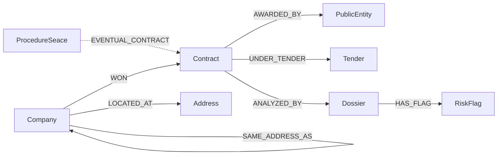
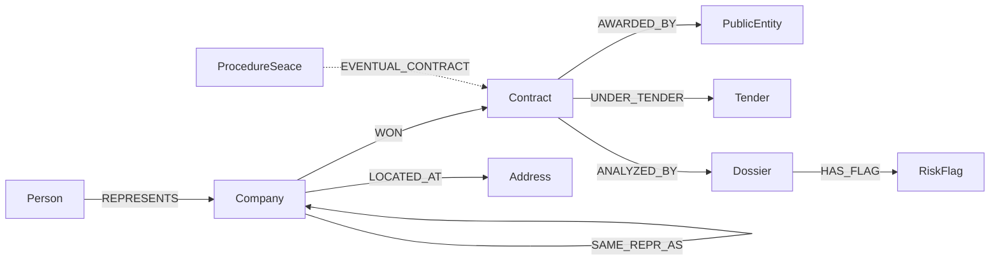

# Ontología Anticorrupción — Neo4j AuraDB
Versión: 2.0 | Fecha: 2026-05-17 | Proyecto: agente-perry

---

## Contexto

Modela contratos públicos peruanos (OCDS Perú, 72,399 registros) cruzados con empresas SUNAT enriquecidas (e-consultaruc scraping completo), análisis de TDRs (3 dossiers procesados) y procedimientos MINAM (37 en downloads/). Objetivo: detectar **19 red flags** de corrupción.

**Cambio v2.0:** El scraping SUNAT es vía e-consultaruc (no padrón reducido). Incluye `representantes_legales`, `cantidad_trabajadores`, `actividades_economicas` (CIIU), `fecha_inicio_actividades`, `deuda_coactiva`, `actas_probatorias`. Esto habilita nodos `Person` y flags adicionales.

---

## Nodos

### :Company
Empresa proveedora de contratos públicos.

| Propiedad | Tipo | Fuente | Notas |
|-----------|------|--------|-------|
| `ruc` | string PK | OCDS supplier_ruc / SUNAT numero_ruc | 11 dígitos. Si nulo: `"hash_" + md5(supplier_name)` |
| `name` | string | SUNAT razon_social / OCDS supplier_name | |
| `nombre_comercial` | string | SUNAT nombre_comercial | |
| `tipo_contribuyente` | string | SUNAT tipo_contribuyente | "SOCIEDAD ANONIMA", "PERSONA NATURAL CON NEGOCIO", etc. |
| `estado` | string | SUNAT estado | "ACTIVO" / "BAJA" |
| `condicion` | string | SUNAT condicion | "HABIDO" / "NO HABIDO" |
| `domicilio_fiscal` | string | SUNAT domicilio_fiscal | Dirección completa (string largo) |
| `fecha_inscripcion` | date | SUNAT fecha_inscripcion | |
| `fecha_inicio_actividades` | date | SUNAT fecha_inicio_actividades | Para medir velocidad de monetización |
| `ciiu_principal` | string | SUNAT actividades_economicas[0] | Código CIIU actividad principal |
| `actividad_principal` | string | SUNAT actividades_economicas[0] | Descripción actividad principal |
| `max_trabajadores` | int | SUNAT cantidad_trabajadores max | Máximo mensual reciente |
| `min_trabajadores` | int | SUNAT cantidad_trabajadores min | Mínimo mensual reciente |
| `deuda_coactiva` | boolean | SUNAT deuda_coactiva | True si no es "Sin información" |
| `omisiones_tributarias` | boolean | SUNAT omisiones_tributarias | True si no es "Sin información" |
| `tiene_actas_probatorias` | boolean | SUNAT actas_probatorias | True si tiene infracciones registradas |
| `is_ruc_complete` | boolean | computed | `size(ruc)=11 AND NOT ruc STARTS WITH 'hash_'` |
| `source` | string[] | — | ["ocds_peru", "sunat_econsulta"] |

### :PublicEntity
Entidad pública compradora (municipalidades, ministerios, EPS, etc.).

| Propiedad | Tipo | Fuente | Notas |
|-----------|------|--------|-------|
| `ruc` | string PK | OCDS entity_ruc | 11 dígitos, 100% presente |
| `name` | string | OCDS entity_name | |
| `region` | string | OCDS region | "LIMA", "CUSCO", etc. |

### :Contract
Contrato adjudicado (OCDS record_type="contract").

| Propiedad | Tipo | Fuente | Notas |
|-----------|------|--------|-------|
| `external_id` | string PK | OCDS external_id | "ocds-dgv273-seacev3-1163548:1163548-1753032" |
| `ocid` | string | OCDS parsed_data.ocid | Clave join con Dossier |
| `tender_id` | string | OCDS parsed_data.tender_id | ID proceso SEACE |
| `award_id` | string | OCDS parsed_data.award_id | |
| `monto` | float | OCDS monto | En PEN |
| `fecha` | date | OCDS fecha | Fecha adjudicación |
| `period_year` | int | OCDS period_year | |
| `procedure_type` | string | OCDS parsed_data.procedure_type | "Adjudicacion Simplificada", "Concurso Público", etc. |
| `region` | string | OCDS region | |
| `evidence_quote` | string | OCDS evidence_quote | Cita textual del acta |

### :Tender
Proceso de licitación (OCDS record_type="procedure") — sin ganador.

| Propiedad | Tipo | Fuente | Notas |
|-----------|------|--------|-------|
| `tender_id` | string PK | OCDS parsed_data.tender_id | |
| `ocid` | string | OCDS parsed_data.ocid | |
| `procedure_type` | string | OCDS parsed_data.procedure_type | |
| `fecha` | date | OCDS fecha | |
| `monto` | float | OCDS monto | Presupuesto base |
| `region` | string | OCDS region | |

### :Address
Domicilio fiscal de empresa (nodo separado para detectar domicilios compartidos).

| Propiedad | Tipo | Fuente | Notas |
|-----------|------|--------|-------|
| `address_hash` | string PK | md5(domicilio_fiscal + ubigeo) | |
| `domicilio_fiscal` | string | SUNAT parsed_data.domicilio_fiscal | |
| `ubigeo` | string | SUNAT raw_data.ubigeo | |
| `tipo_via` | string | SUNAT raw_data.tipo_via | "AV.", "JR.", "CAL." |
| `nombre_via` | string | SUNAT raw_data.nombre_via | |
| `numero` | string | SUNAT raw_data.numero | |
| `tipo_zona` | string | SUNAT raw_data.tipo_zona | "MIRAFLORES", "NARANJAL" |
| `is_generic` | boolean | computed | True si numero="S/N" o vacío |

### :Dossier
Análisis de riesgo de un TDR procesado por el pipeline.

| Propiedad | Tipo | Fuente | Notas |
|-----------|------|--------|-------|
| `ocid` | string PK | results/*/dossier.json → document.ocid | Clave join con Contract |
| `entity_name` | string | results/*/dossier.json | |
| `sector` | string | results/*/dossier.json | "salud", "ambiente_mineria" |
| `procedure_code` | string | results/*/dossier.json | |
| `monto` | float | results/*/dossier.json | |
| `total_score` | int | results/*/dossier.json → risk_summary.total_score | Rango observado: 20–60 |
| `risk_level` | string | results/*/dossier.json → risk_summary.risk_level | "BAJO"/"MEDIO"/"ALTO" |
| `total_flags` | int | results/*/dossier.json | |
| `total_pages` | int | results/*/dossier.json | |
| `coverage_pct` | float | results/*/dossier.json | % texto extraído del PDF |
| `generated_at` | datetime | results/*/dossier.json | |

### :RiskFlag
Flag de riesgo detectado en un TDR.

| Propiedad | Tipo | Fuente | Notas |
|-----------|------|--------|-------|
| `flag_id` | string PK | `ocid + "_" + flag_code + "_p" + page_number` | |
| `flag_code` | string | results/*/flags.json | "LOW_TRACEABILITY_OUTPUT", "OBSOLETE_PHYSICAL_FORMAT" |
| `flag_name` | string | results/*/flags.json | |
| `severity` | string | results/*/flags.json | "LOW"/"MEDIUM"/"HIGH" |
| `score_contribution` | int | results/*/flags.json | 10 por LOW en muestra |
| `page_number` | int | results/*/flags.json | |
| `evidence_quote` | string | results/*/flags.json | Extracto textual del PDF |
| `rule_id` | string | results/*/flags.json | "TDR-R005", "TDR-R002" |
| `detection_method` | string | results/*/flags.json | "rule" / "ai" |

### :ProcedureSeace
Procedimiento MINAM 2024-2025 en ejecución (downloads/). No está en OCDS aún.

| Propiedad | Tipo | Fuente | Notas |
|-----------|------|--------|-------|
| `uuid` | string PK | downloads/*/metadata.json | UUID del procedimiento SEACE |
| `nomenclatura` | string | downloads/*/metadata.json | "AS-SM-1-2024-MINAM/OGA-1" |
| `numero` | int | downloads/*/metadata.json | |
| `entidad` | string | downloads/*/metadata.json | "MINISTERIO DEL AMBIENTE" |
| `descripcion` | string | downloads/*/metadata.json | Objeto del procedimiento |
| `cuantia` | float | downloads/*/metadata.json | En PEN |
| `fecha_hora` | datetime | downloads/*/metadata.json | |
| `completed_targets` | string[] | downloads/*/metadata.json | Etapas completadas |
| `linked_contract_ocid` | string | computed | null hasta que cierre y aparezca en OCDS |

---

## Relaciones

| Relación | Desde → Hasta | Propiedades | Fuente |
|----------|--------------|-------------|--------|
| `WON` | Company → Contract | `monto`, `fecha`, `procedure_type`, `region` | OCDS contract records |
| `AWARDED_BY` | Contract → PublicEntity | — | OCDS entity_ruc |
| `UNDER_TENDER` | Contract → Tender | — | parsed_data.tender_id |
| `LOCATED_AT` | Company → Address | — | SUNAT raw_data |
| `SAME_ADDRESS_AS` | Company → Company | `via_address_hash` | Derivada de Address |
| `ANALYZED_BY` | Contract → Dossier | — | results/*/dossier.json via ocid |
| `HAS_FLAG` | Dossier → RiskFlag | — | results/*/flags.json |
| `EVENTUAL_CONTRACT` | ProcedureSeace → Contract | — | Derivada (null hasta cierre) |

---

## Diagrama Mermaid

---

## Cobertura de nodos por fuente

| Nodo | Records esperados | Fuente | Estado |
|------|-----------------|--------|--------|
| Company | ~30,578 | OCDS supplier | Disponible (sin enrich SUNAT) |
| PublicEntity | ~2,731 | OCDS entity | Disponible |
| Contract | ~55,457 | OCDS contracts | Disponible |
| Tender | ~16,942 | OCDS procedures | Disponible |
| Address | ~25 | SUNAT padrón sample | Solo 25 hasta tener padrón completo |
| Dossier | 3 (piloto) / 20 (índice) | results/ | Piloto disponible |
| RiskFlag | 12 (piloto) | results/flags.json | Piloto disponible |
| ProcedureSeace | 37 | downloads/ | Disponible |

---

### :Person
Representante legal de una empresa (obtenido de SUNAT e-consultaruc).

| Propiedad | Tipo | Fuente | Notas |
|-----------|------|--------|-------|
| `doc_id` | string PK | SUNAT representantes_legales[].Nro. Documento | DNI / CE / RUC |
| `doc_type` | string | SUNAT representantes_legales[].Documento | "DNI", "CE" |
| `name` | string | SUNAT representantes_legales[].Nombre | |

### :RepresentacionLegal
Relación reificada para representante → empresa (tiene propiedades de fecha y cargo).
Alternativa: modelar como relación `:REPRESENTS` con propiedades.

---

## Relaciones (actualizado v2.0)

| Relación | Desde → Hasta | Propiedades | Fuente |
|----------|--------------|-------------|--------|
| `WON` | Company → Contract | `monto`, `fecha`, `procedure_type`, `region` | OCDS |
| `AWARDED_BY` | Contract → PublicEntity | — | OCDS |
| `UNDER_TENDER` | Contract → Tender | — | OCDS |
| `LOCATED_AT` | Company → Address | — | SUNAT domicilio |
| `SAME_ADDRESS_AS` | Company → Company | `via_address_hash` | Derivada |
| `ANALYZED_BY` | Contract → Dossier | — | results/ ocid |
| `HAS_FLAG` | Dossier → RiskFlag | — | results/flags.json |
| `EVENTUAL_CONTRACT` | ProcedureSeace → Contract | — | Derivada |
| `REPRESENTS` | Person → Company | `cargo`, `fecha_desde` | SUNAT representantes_legales |
| `SAME_REPR_AS` | Company → Company | `via_person_doc_id` | Derivada de Person compartido |

---

## Diagrama Mermaid (v2.0)

---

## Cobertura de nodos por fuente (v2.0)

| Nodo | Records esperados | Fuente | Estado |
|------|-----------------|--------|--------|
| Company | ~30,578 | OCDS + SUNAT e-consultaruc | OCDS disponible; SUNAT scraping en curso |
| PublicEntity | ~2,731 | OCDS entity | Disponible |
| Contract | ~55,457 | OCDS contracts | Disponible |
| Tender | ~16,942 | OCDS procedures | Disponible |
| Address | ~924+ | SUNAT domicilio_fiscal | Disponible al terminar scraping |
| Person | variable | SUNAT representantes_legales | Disponible al terminar scraping |
| Dossier | 3 (piloto) | results/ | Piloto disponible |
| RiskFlag | 12 (piloto) | results/flags.json | Piloto disponible |
| ProcedureSeace | 37 | downloads/ | Disponible |

---

## Decisiones de diseño (v2.0)

1. **Company sin RUC**: `"hash_" + md5(supplier_name)` — no joinable con SUNAT.
2. **Address como nodo separado**: detectar domicilios compartidos (F2). Hash = md5(domicilio_fiscal).
3. **Person desde representantes_legales**: `doc_id` = DNI/CE es PK. Permite `SAME_REPR_AS` derivada.
4. **cantidad_trabajadores**: extraer `max` y `min` de los últimos 12 meses → propiedades de Company.
5. **actividades_economicas**: extraer CIIU de la primera actividad (formato "Principal - XXXX - DESCRIPCION").
6. **deuda_coactiva / omisiones / actas**: convertir a boolean (True si string ≠ "Sin información" y no vacío).
7. **Tender vs Contract**: procedures OCDS → Tender. Contracts adjudicados → Contract + WON.
8. **filtered/ no se importa**: subset de OCDS, filtrar por entity_ruc.
9. **SAME_ADDRESS_AS / SAME_REPR_AS**: relaciones derivadas post-carga.
