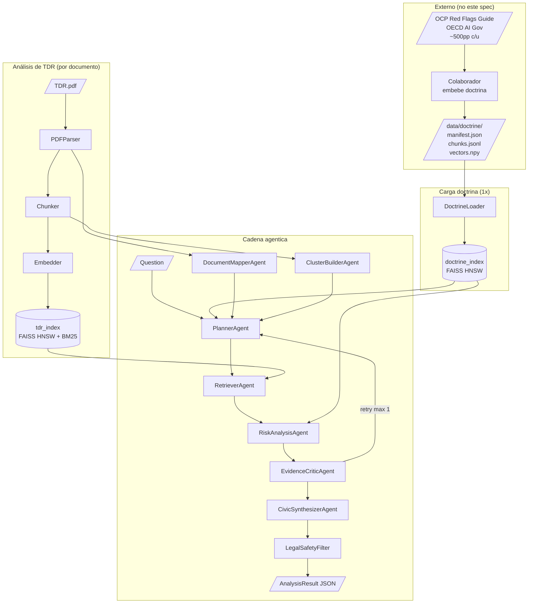

# ARCHITECTURE — Document Intelligence Core (SPEC-0007)

Diagramas y contratos de la cadena de agentes.

## 1. Pipeline general



## 2. Contratos de agentes

| Agente | Input | Output | Modo mock | Modo llm |
|--------|-------|--------|-----------|----------|
| `DocumentMapperAgent` | `list[Page]` | `TDRMap` | regex sobre títulos | LLM resume secciones |
| `ClusterBuilderAgent` | `list[Chunk]` + embeddings | `list[Cluster]` | KMeans / section_hint | LLM nombra clusters |
| `PlannerAgent` | `question` + `TDRMap` + `DoctrineIndex` | `RetrievalPlan` | templates YAML | LLM few-shot |
| `RetrieverAgent` | `RetrievalPlan` + `TDRIndex` | `list[RetrievalHit]` | hybrid vector+BM25 | igual |
| `RiskAnalysisAgent` | `hits` + flag rules | `list[FlagCandidate]` | reglas Python puras | LLM con citas obligatorias |
| `EvidenceCriticAgent` | `FlagCandidate` + TDR text | `FlagCandidate` validada o rechazada | verificación literal de quote | igual + LLM challenge |
| `CivicSynthesizerAgent` | flags + map | `AnalysisResult` (sin pasar filter) | Jinja2 | LLM con prompt restrictivo |
| `LegalSafetyFilter` | `AnalysisResult` | `AnalysisResult` final o excepción | regex + lista negra | igual |

## 3. Flujo de datos: cita doble obligatoria

Toda flag emitida cumple invariante:

```python
assert flag.tdr_evidence.quote in tdr_chunks_text  # literal match
assert flag.doctrine_anchor.quote in doctrine_chunks_text
assert flag.doctrine_anchor.source != ""
assert flag.tdr_evidence.page_number is not None
```

Sin estas 4 condiciones, `EvidenceCriticAgent` rechaza la flag antes de llegar al synthesizer.

## 4. Estrategia de retrieval híbrido

```
Query Q  →  TDR Index
            ├── Vector top-k (k=20)     via FAISS HNSW
            ├── BM25 top-k (k=20)        via rank_bm25
            └── RRF fusion (k=60) → top-10 final
                      │
                      ↓ filtrar por cluster_id ∈ plan.clusters
                      ↓ deduplicar por chunk_id
                      → list[RetrievalHit]
```

RRF (Reciprocal Rank Fusion) formula:

```
score_rrf(d) = Σ 1 / (60 + rank_i(d))   para cada ranker i
```

## 5. Doctrina: stub vs artefacto real

Si `data/doctrine/manifest.json` no existe, se carga `packages/document_intelligence/src/document_intelligence/flags/doctrine_stub.yaml`:

```yaml
# doctrine_stub.yaml (subset OCP, ~50 entries)
- chunk_id: "ocp.tender.over_specified_experience.001"
  source: "OCP Red Flags for Integrity Guide 2024 (stub)"
  section: "Tender phase / Bidder qualification"
  page: 34
  text: "Requirements that match only one historical supplier..."
  flag_code: "OVER_SPECIFIED_EXPERIENCE"
- ...
```

Cuando el colaborador entregue el artefacto real, el sistema detecta el manifest y lo prefiere automáticamente. El stub queda como fallback de desarrollo y CI.

## 6. Catálogo de clusters esperados

Etiquetas canónicas que `ClusterBuilderAgent` intenta matchear. Si una sección no encaja, se etiqueta `Otros`.

```
- Objeto y finalidad
- Antecedentes y justificación
- Alcance del servicio
- Requisitos técnicos
- Experiencia del postor
- Personal clave
- Equipamiento
- Entregables
- Plazos
- Forma de pago
- Penalidades
- Criterios de evaluación
- Anexos / formatos
- Confidencialidad y propiedad
- Otros
```

## 7. Mapeo cluster → flag candidates

Tabla que el `PlannerAgent` consulta tras obtener doctrina:

| Cluster | Flags candidatas |
|---------|-----------------|
| Entregables | `LOW_TRACEABILITY_OUTPUT`, `OBSOLETE_PHYSICAL_FORMAT` |
| Forma de pago | `LOW_TRACEABILITY_OUTPUT` |
| Criterios de evaluación | `SUBJECTIVE_EVALUATION_CRITERIA` |
| Experiencia del postor | `OVER_SPECIFIED_EXPERIENCE` |
| Requisitos técnicos | `SPECIFIC_EQUIPMENT_REQUIREMENT`, `EXCESSIVE_CERTIFICATION_REQUIREMENT` |
| Plazos | `UNREALISTIC_DEADLINE` |
| Anexos / formatos | `EXCESSIVE_DOCUMENT_REQUIREMENT` |

Este mapping vive en `flags/cluster_flag_map.yaml` y se valida contra el catálogo.

## 8. Logs estructurados

Cada etapa emite un evento JSON a stderr (no stdout, para no contaminar `--output`):

```json
{"ts":"2026-05-16T12:00:01Z","stage":"plan","doc":"base_001.pdf","clusters_selected":["Entregables","Plazos"],"queries":["entregable físico impreso","plazo presentación oferta"],"doctrine_hits":7}
```

Permite auditar que el PlannerAgent consultó doctrina antes que TDR (criterio de aceptación 5).

## 9. Decisiones técnicas registradas

- **PyMuPDF over pdfplumber**: mejor extracción de PDFs largos con columnas.
- **FAISS HNSW sobre IVF**: volumen actual < 1M vectores; HNSW da mejor recall/latencia.
- **RRF sobre weighted sum**: insensible a la escala de scores entre rankers heterogéneos.
- **Pydantic v2 strict**: contratos forbid-extra, evita drift silencioso entre agentes.
- **Click sobre Typer**: ya usado en `apps/scrapers`; consistencia.
- **rank-bm25 sobre Tantivy**: dependencia pura Python, sin compilar.
- **Doctrina externa**: no embebemos los 2 PDFs en CI; el colaborador entrega el artefacto.
